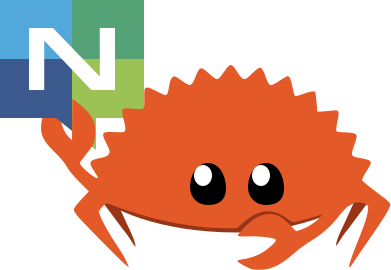

  

    A <a href="https://www.rust-lang.org/">Rust</a> client for the <a href="https://nats.io">NATS messaging system</a>.

## Motivation

Rust may be one of the most interesting new languages the NATS ecosystem has seen.
We believe this client will have a large impact on NATS, distributed systems, and
embedded and IoT environments. With Rust, we wanted to be as idiomatic as we
could be and lean into the strengths of the language. We moved many things that
would have been runtime checks and errors to the compiler, most notably options
on connections, and having subscriptions generate multiple styles of iterators
since iterators are first-class citizens in Rust. We also wanted to be aligned
with the NATS philosophy of simple, secure, and fast!

## Clients

There are two clients available in two separate crates:

### async-nats

Async Tokio-based NATS client.

Supports:

* Core NATS
* JetStream API
* JetStream Management API
* Key Value Store
* Object Store
* Service API

The API is stable, however it remains on 0.x.x versioning, as async ecosystem is still introducing a lot of ergonomic improvements. Some of our dependencies are also considered
stable, yet versioned <1.0.0, like `rustls`, which might introduce breaking changes that can affect our users in some way.

#### Feature flags

Feature flags are Documented in `Cargo.toml` and can be viewed [here](https://docs.rs/crate/async-nats/latest/source/Cargo.toml.orig).

### nats

Legacy *synchronous* client that supports:

* Core NATS
* JetStream API
* JetStream Management API
* Key Value Store
* Object Store

This client does not get updates, unless those are security fixes.
Please use the new `async-nats` crate.

### Documentation

Please refer each crate docs for API reference and examples.

**Additionally Check out [NATS by example](https://natsbyexample.com) - An evolving collection of runnable, cross-client reference examples for NATS.**

## Feedback

We encourage all folks in the NATS and Rust ecosystems to help us
improve this library. Please open issues, submit PRs, etc. We're
available in the `rust` channel on [the NATS slack](https://slack.nats.io)
as well!

