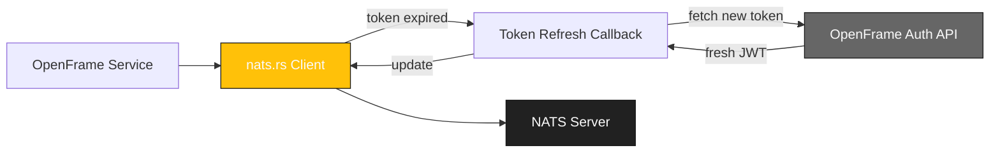

<div align="center">
  <picture>
    <!-- Dark theme -->
    <source media="(prefers-color-scheme: dark)" srcset="https://github.com/flamingo-stack/openframe-oss-tenant/blob/d82f21ba18735dac29eb0f3be5d3edf661bb0060/docs/assets/logo-openframe-full-dark-bg.png">
    <!-- Light theme -->
    <source media="(prefers-color-scheme: light)" srcset="https://github.com/flamingo-stack/openframe-oss-tenant/blob/d82f21ba18735dac29eb0f3be5d3edf661bb0060/docs/assets/logo-openframe-full-light-bg.png">
    <!-- Default / fallback -->
    
  </picture>

  <h1>Nats.rs</h1>

  <p><b>Rust client for NATS messaging system, enhanced with OpenFrame JWT token refresh integration.</b></p>

  <p>
    <a href="LICENSE.md">
      
    </a>
    <a href="https://www.flamingo.run/knowledge-base">
      
    </a>
    <a href="https://www.openmsp.ai/">
      
    </a>
  </p>
</div>

---

## Quick Links
- [Motivation](#motivation)
- [Clients](#clients)
  - [async-nats](#async-nats)
  - [nats (legacy)](#nats)
- [OpenFrame Integration](#openframe-integration)
  - [Token Refresh Callback](#token-refresh-callback)
  - [Usage Examples](#usage-examples)
- [Development](#development)
- [Security](#security)
- [Contributing](#contributing)
- [License](#license)

---

## Motivation

Rust may be one of the most interesting new languages the NATS ecosystem has seen.
We believe this client will have a large impact on NATS, distributed systems, and
embedded and IoT environments. With Rust, we wanted to be as idiomatic as we
could be and lean into the strengths of the language. We moved many things that
would have been runtime checks and errors to the compiler, most notably options
on connections, and having subscriptions generate multiple styles of iterators
since iterators are first-class citizens in Rust. We also wanted to be aligned
with the NATS philosophy of simple, secure, and fast!

---

## Clients

There are two clients available in two separate crates:

### async-nats

[](https://www.apache.org/licenses/LICENSE-2.0)
[](https://crates.io/crates/async-nats)
[](https://docs.rs/async-nats/)
[](https://github.com/nats-io/nats.rs/actions)

Async Tokio-based NATS client.

**Supports:**
- Core NATS
- JetStream API
- JetStream Management API
- Key Value Store
- Object Store
- Service API

The API is stable, however it remains on 0.x.x versioning, as async ecosystem is still introducing a lot of ergonomic improvements. Some of our dependencies are also considered stable, yet versioned <1.0.0, like `rustls`, which might introduce breaking changes that can affect our users in some way.

#### Feature flags

Feature flags are documented in `Cargo.toml` and can be viewed [here](https://docs.rs/crate/async-nats/latest/source/Cargo.toml.orig).

### nats

[](https://www.apache.org/licenses/LICENSE-2.0)
[](https://crates.io/crates/nats)
[](https://docs.rs/nats/)
[](https://github.com/nats-io/nats.rs/actions)

Legacy *synchronous* client that supports:
- Core NATS
- JetStream API
- JetStream Management API
- Key Value Store
- Object Store

This client does not get updates, unless those are security fixes.
Please use the new `async-nats` crate.

---

## OpenFrame Integration

This fork of nats.rs includes OpenFrame-specific enhancements for seamless integration with the OpenFrame ecosystem.

### Token Refresh Callback

**Key Enhancement:** We've added a callback mechanism for automatic JWT token refresh, ensuring uninterrupted connectivity with OpenFrame services.

#### How It Works

When the NATS client detects that the JWT token is about to expire or has expired, it automatically calls your provided callback function to fetch a fresh token from the OpenFrame authentication service. This eliminates the need for manual token management and prevents connection interruptions.

#### Architecture



### Usage Examples

#### Basic Connection with Token Refresh

```rust
use async_nats;
use std::sync::Arc;
use tokio::sync::Mutex;

#[tokio::main]
async fn main() -> Result<(), Box<dyn std::error::Error>> {
    // Create token refresh callback
    let token_callback = Arc::new(Mutex::new(|| async {
        // Fetch fresh token from OpenFrame Auth API
        let client = reqwest::Client::new();
        let response = client
            .post("https://openframe-auth.svc.cluster.local/api/oauth/token")
            .json(&serde_json::json!({
                "grant_type": "refresh_token",
                "refresh_token": std::env::var("REFRESH_TOKEN")?
            }))
            .send()
            .await?;
        
        let token_data: serde_json::Value = response.json().await?;
        Ok(token_data["access_token"].as_str().unwrap().to_string())
    }));

    // Connect with token callback
    let client = async_nats::ConnectOptions::new()
        .jwt_token_callback(token_callback)
        .connect("nats://nats-server.svc.cluster.local:4222")
        .await?;

    // Use the client normally
    let sub = client.subscribe("openframe.events").await?;
    
    while let Some(msg) = sub.next().await {
        println!("Received: {:?}", msg);
    }

    Ok(())
}
```

#### Advanced Configuration with OpenFrame

```rust
use async_nats::{ConnectOptions, ServerAddr};
use std::time::Duration;

#[tokio::main]
async fn main() -> Result<(), Box<dyn std::error::Error>> {
    let openframe_token_refresh = || async {
        // Your OpenFrame token refresh logic
        fetch_fresh_token().await
    };

    let client = ConnectOptions::new()
        // OpenFrame token refresh callback
        .jwt_token_callback(Box::new(openframe_token_refresh))
        // Connection options
        .name("openframe-service")
        .max_reconnects(Some(10))
        .reconnect_delay_callback(|attempts| {
            std::cmp::min(Duration::from_secs(2_u64.pow(attempts as u32)), Duration::from_secs(60))
        })
        // TLS configuration
        .require_tls(true)
        .tls_client_config(tls_config)
        // Connect
        .connect("nats://nats-cluster.openframe.svc.cluster.local:4222")
        .await?;

    // Publish to OpenFrame event stream
    client.publish("openframe.device.created", "device-123".into()).await?;
    
    // Subscribe to OpenFrame events
    let mut subscription = client.subscribe("openframe.alerts.*").await?;
    
    while let Some(message) = subscription.next().await {
        println!("Alert received: {}", String::from_utf8_lossy(&message.payload));
    }

    Ok(())
}

async fn fetch_fresh_token() -> Result<String, Box<dyn std::error::Error>> {
    // Implementation to fetch token from OpenFrame Auth API
    let client = reqwest::Client::new();
    let response = client
        .post("https://openframe-auth.svc.cluster.local/api/oauth/token")
        .header("Content-Type", "application/json")
        .json(&serde_json::json!({
            "grant_type": "client_credentials",
            "client_id": std::env::var("CLIENT_ID")?,
            "client_secret": std::env::var("CLIENT_SECRET")?
        }))
        .send()
        .await?;
    
    let data: serde_json::Value = response.json().await?;
    Ok(data["access_token"].as_str().unwrap().to_string())
}
```

#### JetStream with Token Refresh

```rust
use async_nats::jetstream;

#[tokio::main]
async fn main() -> Result<(), Box<dyn std::error::Error>> {
    // Connect with OpenFrame token refresh
    let client = async_nats::ConnectOptions::new()
        .jwt_token_callback(Box::new(|| async {
            fetch_openframe_token().await
        }))
        .connect("nats://nats.openframe.svc.cluster.local:4222")
        .await?;

    // Create JetStream context
    let jetstream = jetstream::new(client);

    // Create or get stream
    let stream = jetstream
        .get_or_create_stream(jetstream::stream::Config {
            name: "OPENFRAME_EVENTS".to_string(),
            subjects: vec!["openframe.>".to_string()],
            ..Default::default()
        })
        .await?;

    // Publish events
    jetstream
        .publish("openframe.device.updated", "data".into())
        .await?;

    // Create consumer
    let consumer = stream
        .get_or_create_consumer("event-processor", jetstream::consumer::pull::Config {
            durable_name: Some("event-processor".to_string()),
            ..Default::default()
        })
        .await?;

    // Process messages
    let mut messages = consumer.messages().await?;
    while let Some(message) = messages.next().await {
        let msg = message?;
        println!("Processing: {:?}", msg);
        msg.ack().await?;
    }

    Ok(())
}

async fn fetch_openframe_token() -> Result<String, Box<dyn std::error::Error>> {
    // Fetch token from OpenFrame Auth
    // ... implementation
    Ok("fresh_jwt_token".to_string())
}
```

### Configuration

Environment variables for OpenFrame integration:
- `NATS_URL` – NATS server URL (default: `nats://nats.openframe.svc.cluster.local:4222`)
- `OPENFRAME_AUTH_URL` – OpenFrame Auth API URL
- `OPENFRAME_CLIENT_ID` – OAuth client ID
- `OPENFRAME_CLIENT_SECRET` – OAuth client secret
- `OPENFRAME_REFRESH_TOKEN` – Refresh token for token renewal
- `NATS_TLS_CA` – Path to CA certificate for TLS
- `NATS_TLS_CERT` – Path to client certificate
- `NATS_TLS_KEY` – Path to client key

## Development

Build locally:
```bash
cargo build --all
```

Run tests:
```bash
cargo test --all
```

Lint & format:
```bash
cargo fmt --all
cargo clippy --all
```

Run OpenFrame integration tests:
```bash
cargo test --test openframe_integration
```
## Security

- TLS 1.3 enforced for all communication
- JWT and nkey authentication supported with automatic token refresh
- Auto-reconnect with exponential backoff
- Secure credential storage with OpenFrame Auth integration
- Encrypted connection with certificate pinning
- Secure by default (no plain TCP in production)

Found a vulnerability? Email **security@flamingo.run** instead of opening a public issue.

---

## Documentation

Please refer to each crate docs for API reference and examples:
- [async-nats Documentation](https://docs.rs/async-nats/)
- [nats Documentation](https://docs.rs/nats/)
- [OpenFrame Integration Guide](https://www.flamingo.run/knowledge-base/nats-integration)

**Additionally check out [NATS by example](https://natsbyexample.com)** - An evolving collection of runnable, cross-client reference examples for NATS.

### Extensions

Client extensions are available in separate repo under the umbrella project called [Orbit](https://github.com/synadia-io/orbit.rs)

---

## Feedback

We encourage all folks in the NATS, Rust, and OpenFrame ecosystems to help us improve this library. Please open issues, submit PRs, etc. We're available in the `rust` channel on [the NATS slack](https://slack.nats.io) as well!

---

## Contributing

We welcome PRs! Please follow these guidelines:
- Use branching strategy: `feature/...`, `bugfix/...`
- Add descriptions to the **CHANGELOG**
- Follow consistent Rust code style (`cargo fmt`, `cargo clippy`)
- Keep documentation updated in `docs/`
- Write tests for new features
- Ensure backward compatibility with existing OpenFrame services

---

## License

This project is licensed under the **Flamingo Unified License v1.0** ([LICENSE.md](LICENSE.md)).

Based on the original [nats.rs](https://github.com/nats-io/nats.rs) by the NATS.io team, licensed under Apache 2.0.

---

<div align="center">
  <table border="0" cellspacing="0" cellpadding="0">
    <tr>
      <td align="center">
        Built with 💛 by the <a href="https://www.flamingo.run/about"><b>Flamingo</b></a> team
      </td>
      <td align="center">
        <a href="https://www.flamingo.run">Website</a> • 
        <a href="https://www.flamingo.run/knowledge-base">Knowledge Base</a> • 
        <a href="https://www.linkedin.com/showcase/openframemsp/about/">LinkedIn</a> • 
        <a href="https://www.openmsp.ai/">Community</a>
      </td>
    </tr>
  </table>
</div>
