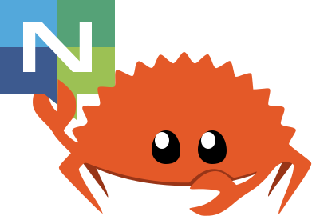

<p align="center">
  
</p>

<p align="center">
    A <a href="https://www.rust-lang.org/">Rust</a> client for the <a href="https://nats.io">NATS messaging system</a>.
</p>

## Motivation

Rust may be one of the most interesting new languages the NATS ecosystem has seen.
We believe this client will have a large impact on NATS, distributed systems, and
embedded and IoT environments. With Rust, we wanted to be as idiomatic as we
could be and lean into the strengths of the language. We moved many things that
would have been runtime checks and errors to the compiler, most notably options
on connections, and having subscriptions generate multiple styles of iterators
since iterators are first-class citizens in Rust. We also wanted to be aligned
with the NATS philosophy of simple, secure, and fast!

## Clients

There is a current, async client, and a deprecated one.

### async-nats

[](https://www.apache.org/licenses/LICENSE-2.0)
[](https://crates.io/crates/async-nats)
[](https://docs.rs/async-nats/)
[](https://github.com/nats-io/nats.rs/actions)

Async Tokio-based NATS client.

Supports:

* Core NATS
* JetStream API
* JetStream Management API
* Key Value Store
* Object Store
* Service API

The API is stable, however it remains on 0.x.x versioning, as async ecosystem is still introducing a lot of ergonomic improvements. Some of our dependencies are also considered
stable, yet versioned <1.0.0, like `rustls`, which might introduce breaking changes that can affect our users in some way.

#### Feature flags

Feature flags are Documented in `Cargo.toml` and can be viewed [here](https://docs.rs/crate/async-nats/latest/source/Cargo.toml.orig).

#### Client and Orbit

NATS client functionality is split across two layers: the **core client**
(`async-nats`, this repo) and **[Orbit](https://github.com/synadia-io/orbit.rs)**,
a separate set of crates with higher-level utilities.

The split exists so the core can stay small, stable, and consistent across
NATS clients in every language, while Orbit can iterate quickly on
opinionated abstractions without dragging the core API along for the ride.

##### Core client (`async-nats`)

- Direct API over Core NATS and JetStream as exposed by `nats-server`.
- Lightweight, unopinionated, performance-oriented.
- API surface kept in **parity** with other official NATS clients
  (Go, .NET, Java, JS, Python, C). A feature shipped here should look
  the same shape everywhere.
- Stable, conservative versioning. Breaking changes are rare and deliberate.

##### Orbit (`orbit.rs`)

- Higher-level, opinionated abstractions built **on top of** the core client.
- Per-crate (per-API) versioning, so an experimental utility can iterate
  without bumping every other piece.
- Free to be language-specific: a Rust-idiomatic API does not need to match
  the Go or Java equivalent.
- May lag, omit, or extend cross-client parity items.

##### What goes where?

| Concern                                            | Core (`async-nats`) | Orbit |
|----------------------------------------------------|:-------------------:|:-----:|
| Connect, publish, subscribe, request/reply         | ✅                  |       |
| JetStream publish, consumers, streams, KV, OS      | ✅                  |       |
| Service API (request/reply micro-services)         | ✅                  |       |
| Wire-protocol coverage, auth, TLS, reconnection    | ✅                  |       |
| Cross-client parity, conservative semver           | ✅                  |       |
| Opinionated helpers / sugar over core APIs         |                     | ✅    |
| New experimental patterns (e.g. partitioned groups)|                     | ✅    |
| KV codecs, distributed counters, NATS contexts     |                     | ✅    |
| Rust-idiomatic abstractions with no parity mandate |                     | ✅    |
| Per-utility versioning, faster API churn allowed   |                     | ✅    |

Rule of thumb: if it is a thin mapping of something `nats-server` already
speaks and every official client must expose it, it belongs in core. If it
is a pattern, helper, or abstraction layered on top, it belongs in Orbit.

```
   ┌──────────────────────────────────────────────────────┐
   │  Application code                                    │
   └──────────────┬───────────────────────────┬───────────┘
                  │                           │
                  ▼                           ▼
        ┌───────────────────┐       ┌───────────────────┐
        │ Orbit crates      │  uses │ async-nats (core) │
        │ (opinionated,     │──────▶│ (parity, stable,  │
        │  per-crate semver)│       │  protocol-level)  │
        └───────────────────┘       └─────────┬─────────┘
                                              │
                                              ▼
                                       ┌─────────────┐
                                       │ nats-server │
                                       └─────────────┘
```

### nats (deprecated)

> **Deprecated:** Use [`async-nats`](https://crates.io/crates/async-nats) instead.
> This crate only receives critical security fixes.

[](https://www.apache.org/licenses/LICENSE-2.0)
[](https://crates.io/crates/nats)
[](https://docs.rs/nats/)

### Documentation

Please refer each crate docs for API reference and examples.

**Additionally Check out [NATS by example](https://natsbyexample.com) - An evolving collection of runnable, cross-client reference examples for NATS.**

## Feedback

We encourage all folks in the NATS and Rust ecosystems to help us
improve this library. Please open issues, submit PRs, etc. We're
available in the `rust` channel on [the NATS slack](https://slack.nats.io)
as well!

